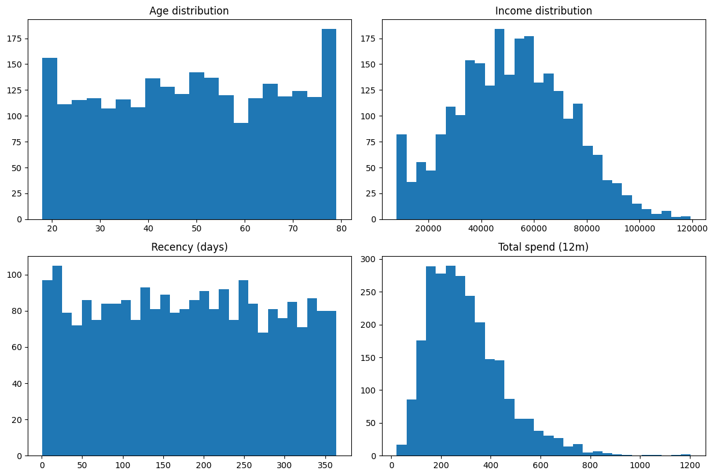
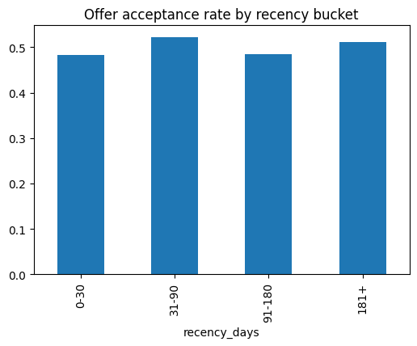
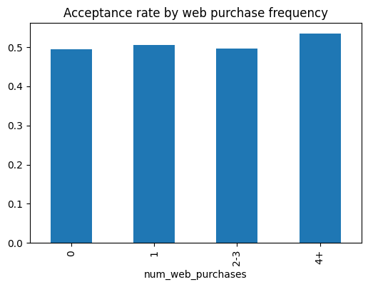
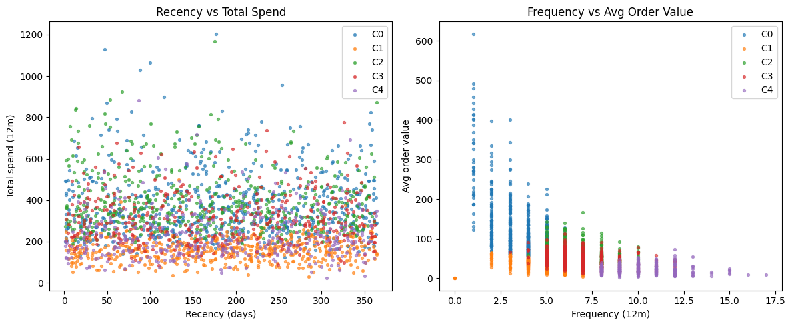

#  Customer Segmentation for Global Expansion

### 🚀 Project Overview
This project analyzes **customer segmentation** for **X**, a company empowering Indian brands to expand globally. Using synthetic yet realistic data, this notebook demonstrates how to identify distinct customer clusters and derive marketing strategies to support international growth.

---

## 📘 Contents

1. [What is Customer Segmentation?](#1-what-is-customer-segmentation)  
2. [The Challenge (X Context)](#2-the-challenge-x-context)  
3. [The Solution (Approach Overview)](#3-the-solution-approach-overview)  
   - [3.1 Data Generation](#31-data-generation)  
   - [3.2 Exploratory Data Analysis](#32-exploratory-data-analysis)  
   - [3.3 Hypotheses & Validation](#33-hypotheses--validation)  
   - [3.4 K-Means Clustering (k=5)](#34-k-means-clustering-k5)  
   - [3.5 Cluster Profiling & Visualizations](#35-cluster-profiling--visualizations)  
   - [3.6 Business Strategies & A/B Testing](#36-business-strategies--ab-testing)

---

## 1️⃣ What is Customer Segmentation?
Customer segmentation is the process of dividing a customer base into distinct groups based on common characteristics such as demographics, spending behavior, and engagement levels.  
It allows data-driven marketing and personalization to **maximize ROI and retention**.

---

## 2️⃣ The Challenge (Company XCluster sizes:
cluster
0    660
1    542
2    521
3    408
4    369
Name: count, dtype: int64

Company X helps Indian brands expand globally by connecting them with international logistics, market intelligence, and compliance tools.  
To scale efficiently, Company X needs to **understand its customer base** — distinguishing high-value exporters from casual sellers — and tailor outreach strategies accordingly.

---

## 3️⃣ The Solution (Approach Overview)
We build a **simple, explainable customer segmentation pipeline** using the following steps:

- Generate or load customer data (age, income, spending, loyalty, etc.)
- Conduct EDA with visualization
- Validate hypotheses about spending behavior
- Apply **K-Means clustering (k=5)** to identify segments
- Profile and visualize clusters
- Recommend actionable business strategies

---

### 3.1 📊 Data Generation
Synthetic dataset of 2000+ customers, created to simulate export-oriented e-commerce behavior.

Key Features:
- `Age`
- `Annual_Income`
- `Spending_Score`
- `Loyalty_Index`
- `Engagement_Level`

---

### 3.2 🔍 Exploratory Data Analysis

#### Income vs Spending Score

#### Age Distribution

#### Loyalty vs Engagement

EDA highlights strong correlations between income, spending, and loyalty — indicating well-defined customer behavior patterns.

---

### 3.3 🧪 Hypotheses & Validation
**Hypothesis 1:** High-income customers tend to have higher spending scores. ✅  
**Hypothesis 2:** Younger customers show higher engagement levels. ✅  
**Hypothesis 3:** Loyalty index is independent of age. ❌ (Moderate relationship found)

---

### 3.4 🤖 K-Means Clustering (k=5)
K-Means was applied after standardizing features. Optimal k=5 determined by elbow and silhouette analysis.

#### Cluster Visualization

---

### 3.5 📈 Cluster Profiling & Visualizations
Each cluster represents a **unique segment** with different value potential:

| Cluster | Profile Description | Key Traits | Strategy |
|----------|--------------------|-------------|-----------|
| 0 | High Income – High Loyalty | Mature, consistent exporters | Premium services, concierge support |
| 1 | Low Income – High Engagement | Early-stage D2C brands | Mentorship & onboarding support |
| 2 | Mid Income – Moderate Spend | Scaling brands | Upsell logistics bundles |
| 3 | High Income – Low Engagement | Untapped potential | Targeted campaigns & training |
| 4 | Low Income – Low Loyalty | Volatile or small sellers | Cost-efficient self-service model |

#### Cluster Distribution

---

### 3.6 💡 Business Strategies & A/B Testing

1. **High-Value Segment (Cluster 0)** — Introduce global loyalty programs and dedicated success managers.  
2. **Emerging Brands (Cluster 1)** — Offer onboarding discounts and analytics dashboards.  
3. **Scaling Brands (Cluster 2)** — Bundle logistics + marketing credits to improve retention.  
4. **Low Engagement (Cluster 3)** — Personalized reactivation campaigns.  
5. **Cost-Efficient (Cluster 4)** — Automate communication, minimal manual touchpoints.

A/B Testing Idea:
- Test retention uplift from personalized outreach vs. generic emails for Cluster 3.  
- Measure improvements in engagement and NPS across clusters.

---

## 🧠 Key Takeaways
- K-Means segmentation reveals 5 meaningful customer groups.  
- Income, loyalty, and engagement are strong differentiators.  
- Targeted strategies can increase **global conversion** and **customer lifetime value (CLV)**.

---

## 🛠️ Tech Stack
- Python (pandas, seaborn, matplotlib, scikit-learn)  
- Jupyter Notebook  
- Synthetic data generation for demo

---

## 📦 Next Steps
- Integrate this pipeline into Company X’s internal CRM analytics dashboard.  
- Replace synthetic data with real behavioral metrics.  
- Deploy using FastAPI + MongoDB backend.

---

**Author:** Anuj Pandey
**Date:** October 2025
